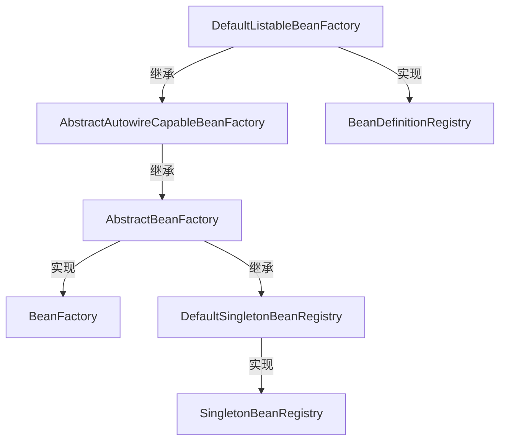
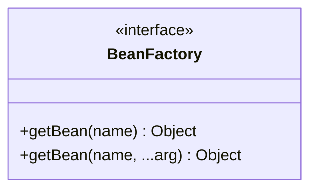
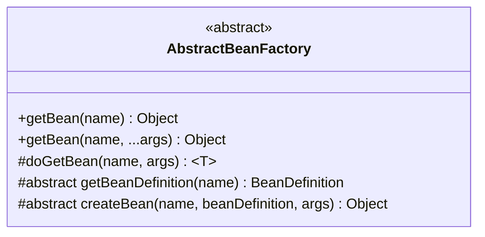
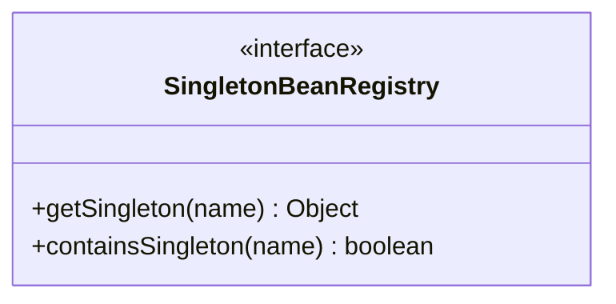
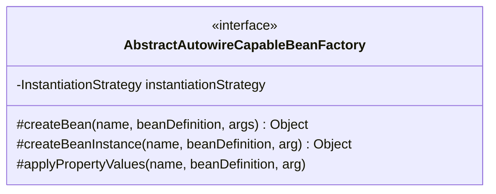

# BeanFactory源码解析


首先感谢一下小傅哥，本文的源码都来自他的专栏：
[Spring 手撸专栏](https://bugstack.cn/md/spring/develop-spring/2021-05-16-%E7%AC%AC1%E7%AB%A0%EF%BC%9A%E5%BC%80%E7%AF%87%E4%BB%8B%E7%BB%8D%EF%BC%8C%E6%89%8B%E5%86%99Spring%E8%83%BD%E7%BB%99%E4%BD%A0%E5%B8%A6%E6%9D%A5%E4%BB%80%E4%B9%88%EF%BC%9F.html)，希望大家多多支持。

这篇文章从最简单的实现开始一步一步扩充

## 初步实现

先来一个集成关系图：



我们通过自底向上来分析`BeanFactory`及其周边类的一个核心功能

### BeanFactory

`BeanFactory`是一个较为底层的核心接口，先看类图：


目前可以看到，`BeanFactory`的核心功能就是通过bean的名称获取bean实例。第二个方法，可以显示的覆盖bean类的构造函数或者工厂方法。

所以，`BeanFactory`及其衍生类的核心功能，就是提供bean对象的存取功能，围绕这点，我们一步步展开对`BeanFactory`的讲解

### AbstractBeanFactory

`AbstractBeanFactory`是对`BeanFactory`的第一层抽象实现（实际上不是，但我们先跳过一些非必要步骤），先浅看一下类图：



先看下两个抽象方法。

`getBeanDefinition(name)`是根据bean的名称查找定义的方法，关于bean的定义这里简单说一下，从bean类到bean对象之间，会有一个叫做bean定义的东西，对应接口`BeanDefinition`。他会保存bean的一些定义信息，创建bean实例之前会先生成bean的定义。既然这个bean 定义的是个抽象方法，那么在他的派生类里必定会实现bean定义的一个容器方法，这里先埋个坑。

再说一下`createBean`方法，这个方法就是为bean的定义创建实例的方法，当然这里只是抽象实现，更多的细节我们到`AbstractAutowireCapableBeanFactory`类再讲。

目前为止，`AbstractBeanFactory`最核心的方法就是上文提到的两个`getBean`方法了，实际上他们都调用了`doGetBean`方法（Spring的源码里有很多这样的写法，其他方法只是一个桥梁，`do`开头的方法往往代表着最终的实现逻辑），看下源代码。

```java
protected <T> T doGetBean(final String name, final Object[] args) {
    Object bean = getSingleton(name);
    if (bean != null) {
      return (T) bean;
    }

    BeanDefinition beanDefinition = getBeanDefinition(name);
    return (T) createBean(name, beanDefinition, args);
}
```

其实比起Spring的源码来讲，这里省略了超多细节，我们这里只提供了单例的方式获取bean对象，勉强够用，问题不大。源码有个`getSingleton`方法，虽然我们没有在`AbstractBeanFactory`类里看到任何蛛丝马迹，但是这个方法实际上是定义在他的超类`DefaultSingletonBeanRegistry`里的，这里略过不表，先看一下主要的代码逻辑。

很简单，这里先尝试通过`getSingleton`方法，看看单例对象的集合里有没有这个bean的实例，如果没有，就通过bean定义来创建一个实例，不难看出，这里其实是一个惰性的实现，只有在获取bean对象的时候才创建它。

接下来我们看一下`getSingleton`的具体实现

### SingletonBeanRegistry & DefaultSingletonBeanRegistry

先看一下接口的定义：



很简单吧，看函数签名就能看出来是啥意思（再次说明，我提供的代码都不是Spring的完整实现），不多说，直接上实现类

```java
public class DefaultSingletonBeanRegistry implements SingletonBeanRegistry {

  private final Map<String, Object> singleBeanMap = new HashMap<>();

  @Override
  public Object getSingleton(String beanName) {
    if (containsSingleton(beanName)) {
      return singleBeanMap.get(beanName);
    }
    return null;
  }

  @Override
  public boolean containsSingleton(String beanName) {
    return singleBeanMap.containsKey(beanName);
  }
  
  protected void addSingleton(String beanName, Object bean) {
    singleBeanMap.put(beanName, bean);
  }
}
```

简单点说，`DefaultSingletonBeanRegistry`类提供了单例bean对象的容器（一个Map对象）以及对这个容器的存取方法。需要注意的是，Spring里这个容器是线程安全的容器(ConcurrentHashMap)，存取的时候也是加了锁的。

### AbstractAutowireCapableBeanFactory

思路不要断，回顾一下`AbstractBeanFactory`类，我们继续。先看类图：



先看一眼`createBeanInstance`方法，在Spring里边，这个方法由`doCreateBean`调用，前文已经说过了，Spring源码里很多具体的实现都是`do`开头的，这里我们省略这一步。首先，这个方法会取出bean类符合条件的构造函数，然后调用一个用于生成实例的策略方法来创建实例。如下：

```java
protected Object createBeanInstance(BeanDefinition beanDefinition, String beanName,
      Object[] args) {
    Constructor<?> constructor = null;
    Class<?> beanClass = beanDefinition.getBeanClass();
    Constructor<?>[] declaredConstructors = beanClass.getDeclaredConstructors();
    for (Constructor<?> declaredConstructor : declaredConstructors) {
      int count;
      if (
          (count = declaredConstructor.getParameterCount()) == 0
      ) {
        if (args == null || args.length == 0) {
          constructor = declaredConstructor;
          break;
        }
      }
      if (args != null && count == args.length) {
        constructor = declaredConstructor;
        break;
      }

    }
    // 这里用了一个策略的设计模式，底层提供JDK和Cglib两种实现方案
    return instantiationStrategy.instantiate(beanDefinition, beanName, constructor, args);
}
```

生成了实例之后肯定就是设置实例属性了，我们的实现很简单，一看就会，需要注意的是，如果属性也是bean对象，那么bean的定义里会存储一份对象的引用。

```java
protected void applyPropertyValues(String beanName, Object bean, BeanDefinition beanDefinition) {
    try {
      PropertyValues propertyValues = beanDefinition.getPropertyValues();

      for (PropertyValue propertyValue : propertyValues.getPropertyValues()) {
        String name = propertyValue.getName();
        Object value = propertyValue.getValue();
        // 对于属性是bean对象的处理
        if (value instanceof BeanReference) {
          BeanReference beanReference = (BeanReference) value;
          value = getBean(beanReference.getBeanName());
        }
        // 可以自己写一个工具类实现
        BeanUtil.setFieldValue(bean, name, value);

      }
    } catch (Exception e) {
      throw new BeansException("Error setting [" + beanName + "] properties value.", e);
    }
}
```

最后简单说一下`createBean`方法，其实就是依次调用了`createBeanInstance`和`applyPropertyValues`，这两个方法执行完成之后bean对象其实就生成好了，然后调用`addSingleton`，把这个对象存储在上文提过的那个Map容器中。

### BeanDefinitionRegistry

讲最顶层的类`DefaultListableBeanFactory`之前，先提一下`BeanDefinitionRegistry`接口，从上文的集成关系图中就可以看出，`DefaultListableBeanFactory`其实是`BeanDefinitionRegistry`的实现，这个接口提供了对bean 定义信息的注册功能，比较easy就不去讲了。

### DefaultListableBeanFactory

这个类的实现其实也十分简单，主要是其他功能已经被他的父类们实现了。直接上代码吧：

```java
private final Map<String, BeanDefinition> beanDefinitionMap = new HashMap<>();

@Override
public void registerBeanDefinition(String beanName, BeanDefinition beanDefinition) {
  beanDefinitionMap.put(beanName, beanDefinition);
}

@Override
public boolean containsBeanDefinition(String beanName) {
  return beanDefinitionMap.containsKey(beanName);
}

@Override
protected BeanDefinition getBeanDefinition(String beanName) throws BeansException {
  if (!beanDefinitionMap.containsKey(beanName)) {
    throw new BeansException();
  }
  return beanDefinitionMap.get(beanName);
}

```

浅聊一下，这个类提供了一个bean definition的容器，同样是一个`Map`容器，同事也实现了对bean定义的注册和或取功能，上文使用到的`getBeanDefinition`方法，就是在这里实现的。

好了第一波实现，完成了，一个超级简单的bean factory就这么实现了。先来看一下使用用例：

```java
@Test
public void testBeanFactory() {
    DefaultListableBeanFactory beanFactory = new DefaultListableBeanFactory();

    BeanDefinition userDaoBeanDefinition = new BeanDefinition(UserDao.class);
    beanFactory.registerBeanDefinition("userDao", userDaoBeanDefinition);

    PropertyValues propertyValues = new PropertyValues();
    propertyValues.addPropertyValue(new PropertyValue("id", "2"));
    propertyValues.addPropertyValue(new PropertyValue("userDao", new BeanReference("userDao")));

    BeanDefinition beanDefinition = new BeanDefinition(UserService.class, propertyValues);
    beanFactory.registerBeanDefinition("userService", beanDefinition);

    UserService userService = (UserService) beanFactory.getBean("userService");
    userService.queryUser();

    UserService userServiceSingleton = (UserService) beanFactory.getBean("userService");
    Assert.assertEquals(userService, userServiceSingleton);
  }
```

## 通过XML文件加载bean定义

