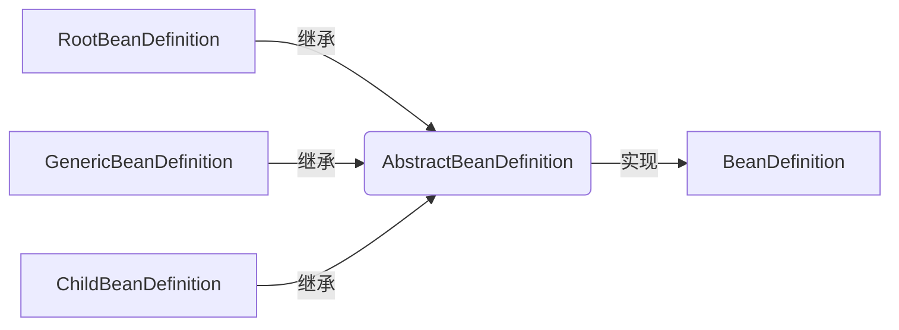

# DefaultListableBeanFactory源码解析

简单来讲，`DefaultListableBeanFactory`是`BeanFactory`的一个上层实现类，所以它提供了Spring Bean工厂的功能，同时也直接实现了`BeanDefinitionRegistry`接口，这个接口提供关于`BeanDefinition`类的功能，比如注册Bean定义，获取Bean定义等，下边具体分析一下其实现。

## BeanDefinition

我们先从`BeanDefinition`来，粗略的查看源码，我们可以发现，这是一个描述bean 定义信息的接口，比如Bean类的ClassName，是不是懒加载，工厂方法等。通过`BeanDefinition`可以准确的描述Bean 类的定义，实例化Bean 对象也可以通过`BeanDefinition`。

具体的视线可以参考`AbstractBeanDefinition`和`RootBeanDefinition`。下边给出简单的集成关系图：



具体实现细节我觉得不用纠结，只要理解`BeanDefinition`是Bean的定义类就好了

### Bean的实例化

Bean的实例化当然是依赖于我们上边提到的`BeanDefinition`，这里我们先看其中一种实现方案，具体看下源码：

```java
// AbstractAutowireCapableBeanFactory
public <T> T createBean(Class<T> beanClass) throws BeansException {
	// 创建一个Bean Definition的实例
	RootBeanDefinition bd = new RootBeanDefinition(beanClass);
	bd.setScope(SCOPE_PROTOTYPE);
	bd.allowCaching = ClassUtils.isCacheSafe(beanClass, getBeanClassLoader());
	return (T) createBean(beanClass.getName(), bd, null);
}

@Override
protected Object createBean(String beanName, RootBeanDefinition mbd, @Nullable Object[] args) throws BeanCreationException { 
    // 省略一些步骤
    RootBeanDefinition mbdToUse = mbd;
    // 其实就是对override属性进行标记及验证
    mbdToUse.prepareMethodOverrides();

    // 
    Object bean = resolveBeforeInstantiation(beanName, mbdToUse);
    if (bean != null) {
        return bean;
    }

    Object beanInstance = doCreateBean(beanName, mbdToUse, args);
    return beanInstance;

}
```


