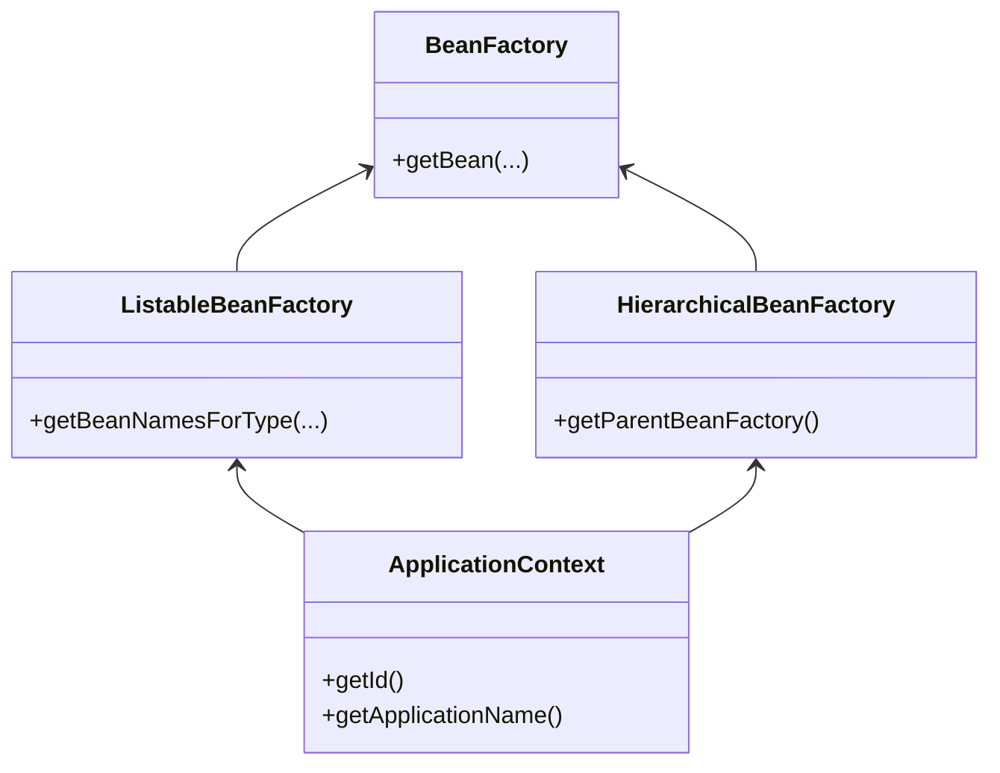

# Spring IoC 

通过查阅维基百科和Spring Framework等文档，对IoC的有一个基本的概念。控制反转（IoC）在程序设计中，是一种设计模式（原文是 programming principle ）。在IoC编程中，由通用的框架程序控制用户自定义程序，我们不必再面对繁重的生命周期和复杂的依赖关系，专心编写核心业务代码。

本文以分析Spring IoC相关的源码为主，不同版本之间可能存在差异，我采用的版本是`5.2.2.RELESAE`。

## 概述

Spring是一个渐进式的框架，不具备很强的侵入性，实际上，我们只需要引入spring-context就可以使用基本的功能了。spring-context会自动引入spring-core、spring-beans、spring-aop等几个基础jar包。我们重点关注的是基于Xml配置的方式。先引入基本的Maven依赖。

```xml
<dependency>
    <groupId>org.springframework</groupId>
    <artifactId>spring-context</artifactId>
    <version>5.2.2.RELEASE</version>
</dependency>
```

通过加载Xml的方式，启动一个最基本的容器：

```java
ApplicationContext applicationContext = new ClassPathXmlApplicationContext("classpath:/META-INF/application-beans.xml");
```

通过`ClassPathXmlApplicationContext`类在class path中加载配置文件，根据配置文件的内容来构建ApplicationContext，ApplicationContext是Spring提供的一个接口，通过Xml的方式只是其中一种实现方式，常见的还有通过注解的形式加载Bean

下边我们看一下怎么生成一个bean，首先创建一个类。

```java
public class User {
  private long id;
  private String name;

  public long getId() {
    return id;
  }

  public void setId(long id) {
    this.id = id;
  }

  public String getName() {
    return name;
  }

  public void setName(String name) {
    this.name = name;
  }
}
```

创建配置文件：
```xml
<?xml version="1.0" encoding="UTF-8"?>
<beans xmlns="http://www.springframework.org/schema/beans"
       xmlns:xsi="http://www.w3.org/2001/XMLSchema-instance"
       xsi:schemaLocation="http://www.springframework.org/schema/beans
        https://www.springframework.org/schema/beans/spring-beans.xsd">

  <bean id="user" class="com.sce.thinking.spring.domain.User">
    <property name="id" value="1" />
    <property name="name" value="小yy" />
  </bean>

</beans>
```

接下来，启动一个容器：

```java
@Slf4j
public class ApplicationContextDemo {
  public static void main(String[] args) {
    // 启动 application context
    ClassPathXmlApplicationContext applicationContext = new ClassPathXmlApplicationContext("classpath:/META-INF/application-beans.xml");

    // 按照类型查找bean
    User user = applicationContext.getBean(User.class);

    log.info("user bean: {}", user);
  }
}
```

以上就是Spring IoC一个很简单的应用，把对User的控制，交给Spring IoC容器。启动过程中，用ApplicationContext负责创建bean 实例。


## ClassPathXmlApplicationContext 分析

ApplicationContext是Spring为应用程序提供了一个底层接口，上层的`ClassPathXmlApplicationContext`和`AnnotationConfigApplicationContext`都间接的实现了它，ApplicationContext也是BeanFactory的子接口，对于Bean相关的操作都委托给BeanFactory来处理。

这里只列出ApplicationContext的部分集成关系和方法：



实例化时候，我们传入配置文件的路径，程序会解析这个路径，调用`refresh()`方法。打开源码可以防线，`refresh()`方法的具体实现实在`AbstractApplicationContext`抽象类中，让我们先看一下具体的代码

```java
public void refresh() throws BeansException, IllegalStateException {
        // 刷新或销毁的时候会上锁
		synchronized (this.startupShutdownMonitor) {
            // 设置启动日期和标志位
            // 处理配置文件中的占位符
			prepareRefresh();

			// 将配置文件解析成bean，并注册到BeanFactory
            // 这一步不包括bean的初始化
			ConfigurableListableBeanFactory beanFactory = obtainFreshBeanFactory();

			// BeanFactory的一些设置
            // 包括bean的类加载器
            // 指定表达式的解析策略等
			prepareBeanFactory(beanFactory);

			try {
				// Allows post-processing of the bean factory in context subclasses.
				postProcessBeanFactory(beanFactory);

				// Invoke factory processors registered as beans in the context.
				invokeBeanFactoryPostProcessors(beanFactory);

				// Register bean processors that intercept bean creation.
				registerBeanPostProcessors(beanFactory);

				// Initialize message source for this context.
				initMessageSource();

				// Initialize event multicaster for this context.
				initApplicationEventMulticaster();

				// Initialize other special beans in specific context subclasses.
				onRefresh();

				// Check for listener beans and register them.
				registerListeners();

				// Instantiate all remaining (non-lazy-init) singletons.
				finishBeanFactoryInitialization(beanFactory);

				// Last step: publish corresponding event.
				finishRefresh();
			}

			catch (BeansException ex) {
				if (logger.isWarnEnabled()) {
					logger.warn("Exception encountered during context initialization - " +
							"cancelling refresh attempt: " + ex);
				}

				// Destroy already created singletons to avoid dangling resources.
				destroyBeans();

				// Reset 'active' flag.
				cancelRefresh(ex);

				// Propagate exception to caller.
				throw ex;
			}

			finally {
				// Reset common introspection caches in Spring's core, since we
				// might not ever need metadata for singleton beans anymore...
				resetCommonCaches();
			}
		}
	}
```
