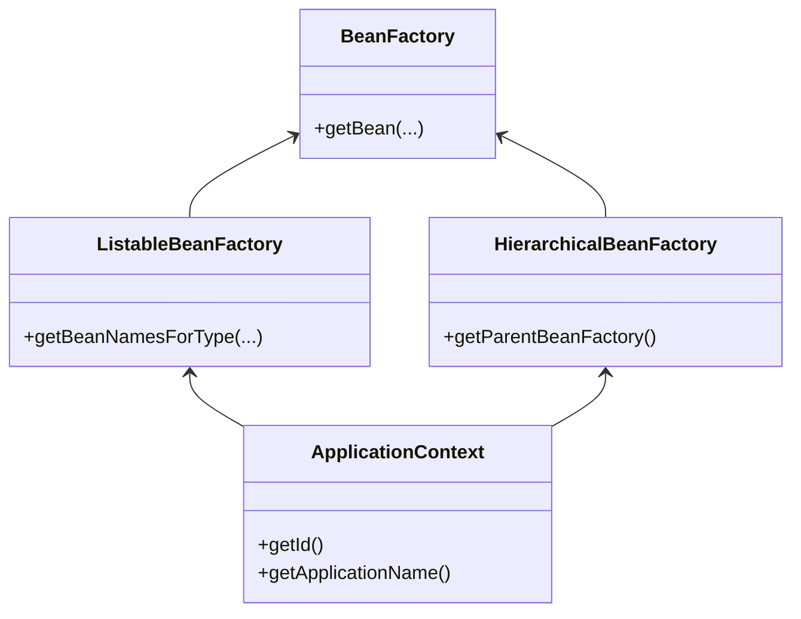

# Spring IoC 

通过查阅维基百科和Spring Framework等文档，对IoC的有一个基本的概念。控制反转（IoC）在程序设计中，是一种设计模式（原文是 programming principle ）。在IoC编程中，由通用的框架程序控制用户自定义程序，我们不必再面对繁重的生命周期和复杂的依赖关系，专心编写核心业务代码。

本文以分析Spring IoC相关的源码为主，不同版本之间可能存在差异，我采用的版本是`5.2.2.RELESAE`。

## 概述

Spring是一个渐进式的框架，不具备很强的侵入性，实际上，我们只需要引入spring-context就可以使用基本的功能了。spring-context会自动引入spring-core、spring-beans、spring-aop等几个基础jar包。我们重点关注的是基于Xml配置的方式。先引入基本的Maven依赖。

```xml
<dependency>
    <groupId>org.springframework</groupId>
    <artifactId>spring-context</artifactId>
    <version>5.2.2.RELEASE</version>
</dependency>
```

通过加载Xml的方式，启动一个最基本的容器：

```java
ApplicationContext applicationContext = new ClassPathXmlApplicationContext("classpath:/META-INF/application-beans.xml");
```

通过`ClassPathXmlApplicationContext`类在class path中加载配置文件，根据配置文件的内容来构建ApplicationContext，ApplicationContext是Spring提供的一个接口，通过Xml的方式只是其中一种实现方式，常见的还有通过注解的形式加载Bean

下边我们看一下怎么生成一个bean，首先创建一个类。

```java
public class User {
  private long id;
  private String name;

  public long getId() {
    return id;
  }

  public void setId(long id) {
    this.id = id;
  }

  public String getName() {
    return name;
  }

  public void setName(String name) {
    this.name = name;
  }
}
```

创建配置文件：
```xml
<?xml version="1.0" encoding="UTF-8"?>
<beans xmlns="http://www.springframework.org/schema/beans"
       xmlns:xsi="http://www.w3.org/2001/XMLSchema-instance"
       xsi:schemaLocation="http://www.springframework.org/schema/beans
        https://www.springframework.org/schema/beans/spring-beans.xsd">

  <bean id="user" class="com.sce.thinking.spring.domain.User">
    <property name="id" value="1" />
    <property name="name" value="小yy" />
  </bean>

</beans>
```

接下来，启动一个容器：

```java
@Slf4j
public class ApplicationContextDemo {
  public static void main(String[] args) {
    // 启动 application context
    ClassPathXmlApplicationContext applicationContext = new ClassPathXmlApplicationContext("classpath:/META-INF/application-beans.xml");

    // 按照类型查找bean
    User user = applicationContext.getBean(User.class);

    log.info("user bean: {}", user);
  }
}
```

以上就是Spring IoC一个很简单的应用，把对User的控制，交给Spring IoC容器。启动过程中，用ApplicationContext负责创建bean 实例。


## ClassPathXmlApplicationContext 启动过程分析

ApplicationContext是Spring为应用程序提供了一个底层接口，上层的`ClassPathXmlApplicationContext`和`AnnotationConfigApplicationContext`都间接的实现了它，ApplicationContext也是BeanFactory的子接口，对于Bean相关的操作都委托给BeanFactory来处理。

这里只列出ApplicationContext的部分集成关系和方法：



实例化时候，我们传入配置文件的路径，程序会解析这个路径，并调用`refresh()`方法。

`refresh()`方法会做一些启动相关的准备工作，比如处理配置文件中的占位符，解析bean的定义加载到Bean工厂当中，初始化事件广播器，注册时间监听器，以及最为重要的初始化所有非懒加载的单例bean对象。

```java
public void refresh() throws BeansException, IllegalStateException {
   // 锁住容器的创建和销毁操作
   synchronized (this.startupShutdownMonitor) {

      // 一些启动的准备工作，比如设置启动时间和标志位
      // 处理配置文件的占位符等
      prepareRefresh();

      // 刷新Bean Factory
      // 解析bean的配置文件，并加载到新的BeanFactory
      // 需要注意的是这里并不是bean的初始化，只是将配置文件的信息加载出来，保存到注册中心
      ConfigurableListableBeanFactory beanFactory = obtainFreshBeanFactory();

      // BeanFactory的准备工作
      // 比如设置类加载器、注册一些特殊的bean
      prepareBeanFactory(beanFactory);

      try {
         // 如果bean类实现了BeanFactoryPostProcessor接口
         // 那么容器初始化之后会负责调用该接口的postProcessBeanFactory方法
         // 此时bean还未被初始化，所以可以在这里做一些扩展性的功能
         postProcessBeanFactory(beanFactory);
         // 调用实现了BeanFactoryPostProcessor接口的postProcessBeanFactory方法
         invokeBeanFactoryPostProcessors(beanFactory);

         // 实例化并注册所有实现了BeanPostProcessor的bean
         // 该接口提供了bean初始化之前和之后执行的两个方法
         registerBeanPostProcessors(beanFactory);

         // 初始化MessageSource，用于国际化处理
         initMessageSource();

         // 初始化事件广播器。ApplicationEventMulticaster 接口的实现类
         initApplicationEventMulticaster();

         // 是一个模版方法，具体实现由子类提供，默认情况下啥也不做
         // 这个方法可以用来初始化一些特殊的Bean
         onRefresh();

         // 注册事件监听器。ApplicationListener
         registerListeners();

         // 初始化所有的单例bean，同时会设置bean的属性
         finishBeanFactoryInitialization(beanFactory);

         //初始化完成，发布相应的事件
         finishRefresh();
      }

      catch (BeansException ex) {
         if (logger.isWarnEnabled()) {
            logger.warn("Exception encountered during context initialization - " +
                  "cancelling refresh attempt: " + ex);
         }

         // 销毁已经初始化的单例Bean，避免悬空资源
         destroyBeans();

         // 重置标志位等
         cancelRefresh(ex);

         throw ex;
      }

      finally {
         // 重置公共的缓存，主要是反射的缓存
         resetCommonCaches();
      }
   }
}
```

下边分析一下refresh函数里一些重要的方法。

### 刷新BeanFactory

这里我们解析一下`obtainFreshBeanFactory()`方法。该
```java
    if (hasBeanFactory()) {
			destroyBeans();
			closeBeanFactory();
		}
		try {
			DefaultListableBeanFactory beanFactory = createBeanFactory();
			beanFactory.setSerializationId(getId());
			customizeBeanFactory(beanFactory);
			loadBeanDefinitions(beanFactory);
			synchronized (this.beanFactoryMonitor) {
				this.beanFactory = beanFactory;
			}
		}
		catch (IOException ex) {
			throw new ApplicationContextException("I/O error parsing bean definition source for " + getDisplayName(), ex);
		}
```